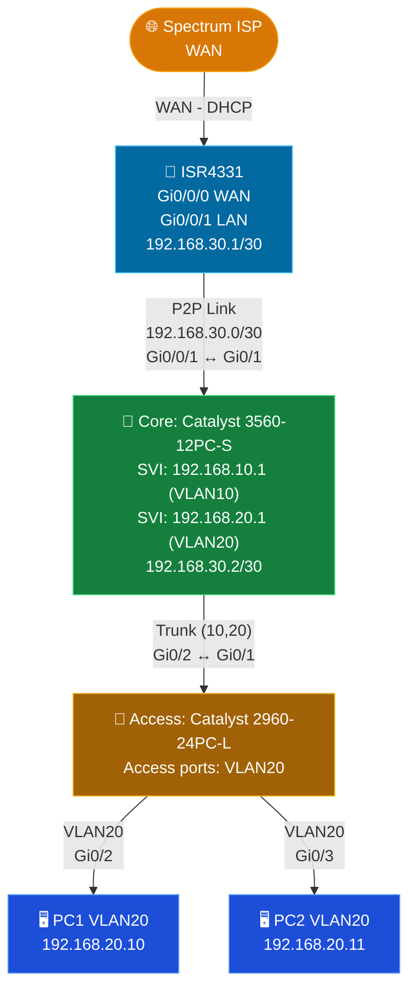
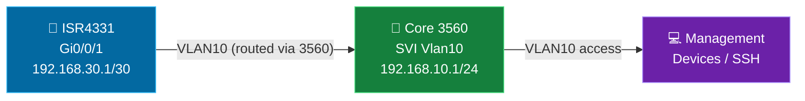
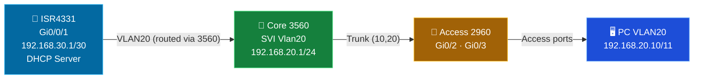
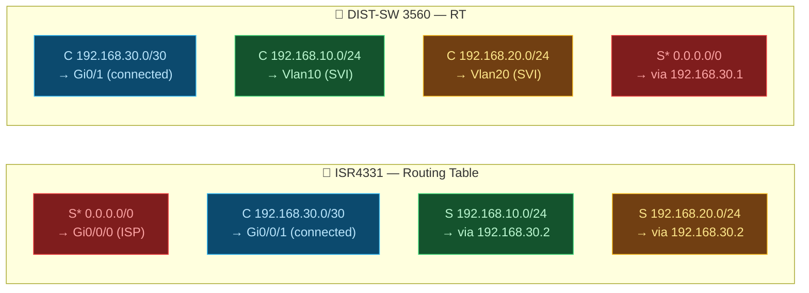

# SPEC-2-Homelab-4300-Isolated-Router-Catalyst-3560-2960-
## README.md              
[📄 View the full Spec-10 Lab Manual](SPEC10-2025.md)

# SPEC-2025-LAB

[📄 View the PDF](./network-topology%20homelab-pdf.pdf)

##  PHYSICAL HOMELAB

  

## VLAN Plan + Topology Diagrams (Master + per-VLAN)

### VLAN Plan

| VLAN ID | Name         | Purpose                  |
|---------|--------------|--------------------------|
| 10      | Management   | Switches, core mgmt      |
| 20      | Workstations | PCs, laptops             |

---

### Topology Diagrams (Master + per-VLAN)

---

### VLAN 10 (Management) Topology

---

### VLAN 20 Topology

---

### IP Routing Table (ISR4331)

## IP Address & VLAN Plan

| SEGMENT | SUBNET | DEVICE / INTERFACE | ADDRESS | ROLE |
|---------|--------|--------------------|---------|------|
| WAN | DHCP | ISR4331 Gi0/0/0 | Dynamic (ISP) | Internet uplink |
| P2P Link | 192.168.30.0/30 | ISR4331 Gi0/0/1 | 192.168.30.1 | Router LAN port |
| P2P Link | 192.168.30.0/30 | DIST-SW Gi0/1 (routed) | 192.168.30.2 | 3560 uplink |
| VLAN 10 | 192.168.10.0/24 | DIST-SW Vlan10 SVI | 192.168.10.1 | Management |
| VLAN 20 | 192.168.20.0/24 | DIST-SW Vlan20 SVI | 192.168.20.1 | Workstations GW |
| VLAN 20 | 192.168.20.0/24 | PC1 (Win11) | 192.168.20.10 | Static / DHCP |
| VLAN 20 | 192.168.20.0/24 | PC2 (Raspberry Pi) | 192.168.20.11 | Static / DHCP |

---

   
